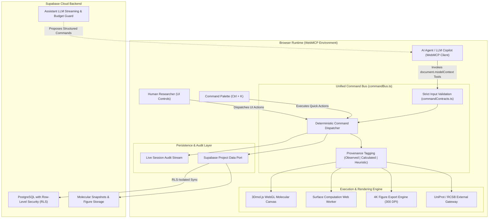

<div align="center">

  

  # BioFold 3D

  **The First WebMCP-Native Molecular Workspace: Humans and AI Agents Exploring Live Protein Structures Together.**

  [](https://www.typescriptlang.org/)
  [](https://vitejs.dev/)
  [](https://react.dev/)
  [](https://vitest.dev/)
  [](https://supabase.com/)
  [](#how-biofold-3d-advances-webmcp)
  [](./LICENSE)

</div>

---

## Executive Summary

**BioFold 3D** is an autonomous structural biology platform and collaborative molecular canvas designed for the era of AI agents. Rather than treating artificial intelligence as an external chatbot or relying on fragile computer vision (screenshot-clicking) to interact with complex 3D graphics, BioFold 3D implements the **Web Model Context Protocol (WebMCP)**. 

Through WebMCP, BioFold transforms the browser itself into an API: browser-based AI agents and human researchers interact with the exact same live 3D molecular structures through a shared, typed **Command Bus**, producing an immutable, scientifically provenance-tracked audit trail.

Whether rotating a hemoglobin tetramer, computing van der Waals solvent surfaces, measuring inter-atomic distances, querying UniProt functional sites, or exporting 4K publication figures, humans and agents act as peer investigators on the same molecular scene.

---

## How BioFold 3D Advances WebMCP

BioFold 3D serves as a **reference implementation and pioneer** for the emerging Web Model Context Protocol (WebMCP) standard within data-intensive scientific applications.



### 1. Eliminating the "Computer Vision" Bottleneck
Historically, autonomous browser agents relied on pixel interpretation, OCR, and synthetic mouse clicks to operate web applications. In scientific WebGL contexts (like molecular viewers), this approach fails catastrophically: atoms cannot be reliably clicked, camera transformations drift, and numerical measurements are distorted.
BioFold 3D solves this by exposing **13 imperative WebMCP tools** directly in `document.modelContext`. The agent queries structured molecular summaries and dispatches commands with sub-ångström mathematical precision.

### 2. Symmetrical Architecture: The Unified Command Bus
Every capability in BioFold 3D is defined as a domain command (`CommandName`). The human clicking "Compute Surface" in the sidebar and the agent issuing `show_surface({ visible: true, opacity: 0.8 })` invoke the exact same function in `src/core/commandBus.ts`.
- **Zero backdoor mutations:** State is never altered behind the agent's or user's back.
- **Identical validation:** All payloads pass through `commandContracts.ts` schema validators.
- **Universal provenance:** Every action is attributed to either `human` or `agent` and logged into the session audit stream.

### 3. Human-in-the-Loop Safe Autonomy
Agent autonomy must be safe and verifiable in scientific research:
- **Proposal Protocol:** When the embedded AI assistant decides a visual change is needed, it issues a `CommandProposal` with a scientific rationale.
- **Explicit Consent:** Proposals render interactive confirmation cards in the UI requiring the researcher to click **Apply** or **Dismiss**.
- **Non-Destructive Defaults:** Destructive operations (such as resetting scenes or deleting bookmarks) are explicitly marked with `destructiveHint: true` and cannot be run silently.

### 4. Zero-Install, Native Browser Compatibility
BioFold registers its tools through Chrome's native WebMCP API once the authenticated Laboratory (`/app/lab`) viewer is ready. The header shows the current registration status. Use DevTools → Application → WebMCP for manual calls, or the Model Context Tool Inspector extension for agent chat. The built-in BioFold Copilot remains a separate integration. See [Chrome setup and testing](docs/WEBMCP_TESTING.md).

---

## The 13 Audited WebMCP Tools

When an agent enters `/app/lab`, BioFold dynamically registers 13 specialized tools with strict JSON Schema inputs, read-only hints, and evidence levels:

| # | Tool Name | Parameters | Scientific Purpose | Evidence Level |
| :--- | :--- | :--- | :--- | :--- |
| **1** | `load_structure` | `pdbId` (string, 4 chars) | Ingests structural coordinates from RCSB PDB or bundled offline fixtures (`1CRN`, `4HHB`). | **Observed** |
| **2** | `get_structure_summary` | *None* | Computes exact counts of chains, amino acid residues, atoms, bound ligands, and waters. | **Calculated** |
| **3** | `focus_residues` | `chain`, `residueNumber`, `label?` | Centers and zooms the camera on a critical residue with sidechain atom highlighting. | **Observed** |
| **4** | `set_representation` | `style` (`cartoon` \| `stick` \| `sphere` \| `line`), `colorScheme` (`chain` \| `spectrum` \| `element`) | Changes molecular render styles and color mappings dynamically. | **Calculated** |
| **5** | `show_surface` | `visible` (boolean), `opacity` (0.1–1.0) | Generates solvent-accessible / van der Waals molecular surface in a background Web Worker. | **Calculated** |
| **6** | `measure_distance` | `from` (`chain`, `res`, `atom`), `to` (`chain`, `res`, `atom`) | Calculates sub-ångström Euclidean 3D distance and renders a labeled measurement vector. | **Calculated** |
| **7** | `preview_mutation_context` | `residue` (`chain`, `res`), `toAminoAcid` | Identifies 5.0 Å spatial neighbors and calculates physicochemical shifts ($\Delta\text{charge}$, $\Delta\text{volume}$, $\Delta\text{hydropathy}$). | **Heuristic** |
| **8** | `reset_workspace` | `scope` (`view` \| `all`) | Resets camera position, clears active residue selections, or restores default workspace settings. | **Calculated** |
| **9** | `export_publication_figure` | `resolution` (`1x` \| `2x` \| `4k`), `background` (`transparent` \| `white` \| `dark`), `format` | Autonomous high-resolution capture with 300 DPI metadata injection ready for scientific journals. | **Calculated** |
| **10** | `annotate_active_site` | `chain`, `residueNumber`, `note`, `color?` | Creates persistent 3D spatial bookmarks on catalytic triads or ligand binding pockets. | **Observed** |
| **11** | `query_uniprot_annotations` | `pdbId?`, `highlightInViewer?` | Fetches verified active sites, disulfide bonds, and ClinVar pathogenic variants from UniProtKB. | **Observed** |
| **12** | `compare_structures_rmsd` | `referencePdbId`, `mobilePdbId` | Performs $\text{C}\alpha$ coordinate superposition and computes structural Root Mean Square Deviation ($\text{RMSD}$ in Å). | **Calculated** |
| **13** | `save_project_snapshot` | `title`, `description?` | Persists the entire active workspace (coordinates, view, bookmarks, surface) as a revisioned snapshot. | **Calculated** |

---

## Platform Features & Recent Advances

### 1. Unified Identity & Classical Medallion Brand
- **Official Athena Emblem:** High-resolution circular medallion combining classical scientific iconography (Athena silhouette, DNA double helix hair, medical caduceus, engineering gears, microchip in palm, and cybernetic circuit traces).
- **Responsive Geometry:** Perfectly centered circular badges (`/public/logo.png`, `logo-circle.png`, `logo-square.png`) and vector-grade favicons with sub-pixel anti-aliasing across all devices.

### 2. Global Command Palette (`Ctrl + K` / `Cmd + K`)
- **Instant Raycast/Spotlight Search:** Available from any route in the application.
- **Universal Biological Lookup:** Search molecules by 4-letter PDB ID (`6LU7`, `4HHB`), UniProt accession (`P04637`), or common biological names (*Hemoglobin*, *Spike Glycoprotein*, *Insulin*).
- **Fast Navigation & Tool Triggering:** Jump between Home, Laboratory, Vision Studio, Account, or trigger 4K exports and surface calculations with keyboard shortcuts.

### 3. Notification Center (🔔) & Session History
- **Persistent Header Dropdown:** Displays real-time toast alerts and history of completed background actions (file uploads, figure exports, cloud snapshots).
- **Categorized Tabs:** Filter notifications by *All*, *Exports*, *Storage*, or *System*.
- **Unread Badges:** Live count indicator synchronized with local and cloud storage.

### 4. Interactive User Menu
- **Profile Avatar:** Displays user initials or Google OAuth photo.
- **Connection Health:** Live Supabase connectivity and authentication status indicator.
- **Quick Actions:** Instant access to account settings, documentation, and 1-click Sign Out without navigating away from ongoing experiments.

### 5. Multimodal Vision Studio (`/app/vision`)
- **Comparative Molecular Analysis:** Inspect structural features alongside secondary structure topologies and mutational energy landscapes.
- **Curated Scientific Presets:**
  - *Binding Pocket Analysis:* 3D active site vs. 2D interaction schematics.
  - *Secondary Structure Mapping:* $\alpha$-helix and $\beta$-sheet coordinate correlations.
  - *Deep Mutational Landscapes:* Heatmaps cross-referenced against spatial residue positions.

### 6. 3D Spatial Bookmarks & Time Travel
- **Residue-Linked Annotations:** Pin observations directly to coordinates in 3D space with customizable color coding.
- **Time Travel Timeline:** Replay and inspect the chronological history of human and agent actions across the active session.

### 7. Public Project Sharing (`/share/:token`)
- **Cryptographic Share Links:** Share interactive 3D structures with peer reviewers and collaborators.
- **Read-Only Sandbox:** Guests explore representations, surface maps, and bookmarks without authentication, while database RLS strictly blocks unauthorized mutations.

### 8. 4K Publication Figure Export Engine
- **Journal-Ready Graphics:** Export at 1x, 2x, or 4K Ultra-HD resolution with anti-aliasing.
- **Custom Backgrounds:** Choose pure white (print), dark `#08110e` (presentations), or transparent PNG.
- **Automatic DPI Injection:** Embeds physical print resolution (`pHYs` chunk at 300 DPI) directly into the PNG file header.
- **One-Click Clipboard & Download:** Copy figures directly to clipboard or trigger automated file downloads.

### 9. Scientific Report Generation Service
- **Automated Printable Reports:** Compiles current molecular structures, active residue selections, spatial measurements, and WebMCP provenance logs into formatted scientific documents.
- **Print & PDF Export:** Integrated window print dispatcher with browser print fallback handling and full styling support for journal submissions.

### 10. Cinematic Landing Stage & Video Experience
- **Interactive Video Hero:** HTML5 video stage (`/public/media/helix.mp4` / `.webm`) with fallback image posters and smooth progress controls (`useStageProgress`).
- **WebMCP Tool Demonstrations:** Direct visual overview of all 13 audited WebMCP tools and live Command Bus interaction loops.

---

## Application Route Map

| Route | Access | Purpose | Key Capabilities |
| :--- | :--- | :--- | :--- |
| `/` | Public | Landing Page | Cinematic video stage, architecture diagrams, WebMCP tools catalog, feature showcase. |
| `/login` | Public | Authentication | Email/password sign-in, Google OAuth, session recovery. |
| `/signup` | Public | Account Creation | Client-side validation, password strength meter, email confirmation. |
| `/forgot-password` | Public | Password Reset | Password reset request via email magic link. |
| `/reset-password` | Guarded | Set New Password | Secure password change guarded by PKCE recovery token. |
| `/app` | Authenticated | Dashboard | Saved projects list, quick structure loaders, persistence status indicators. |
| `/app/lab` | Authenticated | 3D Laboratory | 3Dmol WebGL canvas, 13 WebMCP tools, Inspector (Results + Copilot Chat), 4K export. |
| `/app/vision` | Authenticated | Vision Studio | Multimodal split-view presets, comparative spatial inspection. |
| `/app/account` | Authenticated | Profile & Security | User metadata updates, session status, security audit notes. |
| `/share/:token` | Public | Shared Project | Read-only interactive 3D project viewer for reviewers and collaborators. |
| `*` | Public | 404 Uncharted | Friendly route recovery. |

---

## Quality Assurance & Testing Suite

BioFold 3D enforces rigorous quality standards with a **zero-compromise test suite**:

```bash
# Run complete unit, component, and contract test suite (Vitest)
pnpm test

# Run tests in watch mode
pnpm test:watch

# Execute strict TypeScript type verification
pnpm typecheck

# Check code formatting and ESLint rules
pnpm lint

# Production build verification (Vite)
pnpm build
```

### Test Suite Status
- **64/64 test files passing (100%)**
- **459 automated tests passing**
- Coverage includes:
  - Strict JSON schema validation for all 13 WebMCP tools.
  - PostgreSQL Row-Level Security (RLS) simulation for multi-tenant isolation.
  - Concurrency conflict detection (`revision` optimistic locking).
  - WebGL viewer mocks and non-blocking Web Worker triangulation.
  - Accessibility compliance (WCAG 2.1 AA contrast ratios, minimum 12px fonts, keyboard navigation).

---

## Getting Started & Local Development

### Prerequisites
- **Node.js:** v22.12.0 or higher (Node 26 recommended)
- **Package Manager:** `pnpm` v10+ or v11 (see `packageManager` in `package.json`)
- **Browser:** Current Google Chrome with WebMCP enabled to test browser agent tools; native integration tested on Chrome 152. Run `pnpm test:webmcp` for the dedicated browser suite.

### 1. Clone & Install
```bash
git clone https://github.com/JosueACondoriCh123/BioFold.git
cd BioFold
pnpm install
```

### 2. Environment Configuration
Copy the sample environment file:
```bash
cp .env.example .env.local
```

Configure your `.env.local` with your public Supabase project credentials:
```ini
# Supabase Project URL (https://<project-ref>.supabase.co)
VITE_SUPABASE_URL=https://your-project.supabase.co

# Supabase Public Anon/Publishable Key
VITE_SUPABASE_PUBLISHABLE_KEY=sb_publishable_your_key_here
```

### 3. Launch Development Server
```bash
pnpm dev
```
Navigate to `http://127.0.0.1:4173` to explore the application.

---

## Database Architecture & Migrations

BioFold's persistent storage is backed by Supabase PostgreSQL migrations located in [`supabase/migrations/`](./supabase/migrations/):

1. `20260901000000_enable_extensions_and_helpers.sql`: Activates `pgvector` and automated timestamp triggers.
2. `20260901000001_create_profiles_and_projects.sql`: User profiles and private projects with owner-isolated RLS.
3. `20260901000002_create_project_events.sql`: Audit event log with domain status and evidence levels.
4. `20260901000003_create_conversations_and_messages.sql`: Streaming AI conversation threads and token records.
5. `20260901000004_create_ai_requests_and_structure_metadata.sql`: Token quotas and structure caching.
6. `20260901000005_create_knowledge_corpus.sql`: Vector chunk embeddings (`vector(384)`) with HNSW cosine indexing.
7. `20260901225652_phase2_assistant_rag.sql`: Hybrid full-text + vector search with Reciprocal Rank Fusion.
8. `20260902233000_phase2_3_db_controls.sql`: Daily budget controls, rate-limit RPCs, and least-privilege grants.
9. `20260903200000_storage_and_annotations.sql`: Storage buckets for snapshots, 4K figures, and 3D residue bookmarks.
10. `20260903210000_public_sharing.sql`: Cryptographic token-based public sharing with read-only security policies.

---

## Scientific Scope & Ethical Boundaries

BioFold 3D is designed for **exploratory structural research, educational visualization, and agent-assisted analysis**.
- **Mutation Preview:** Evaluates static geometric neighborhoods ($\le 5.0$ Å) and physicochemical shifts (hydropathy, charge, volume). It does *not* replace full molecular dynamics, binding affinity free-energy calculations ($\Delta\Delta G$), or clinical variant classification.
- **Coordinate Fidelity:** Coordinates are rendered as curated from RCSB mmCIF / PDB records and static offline fixtures.
- **Security & Privacy:** Molecular structures and session notes belong exclusively to the researcher; client-side keys never possess administrative database permissions.

---

## License & Scientific Provenance

- **Application Code:** [MIT License](./LICENSE) — © 2026 BioFold Contributors.
- **Molecular Graphics Engine:** [3Dmol.js](https://3dmol.org/) (BSD-3-Clause).
- **Structural Data:** Curated experimental records (`1CRN`, `4HHB`, `6LU7`) via the [RCSB Protein Data Bank](https://www.rcsb.org/).
- **Biological Annotations:** Functional site data sourced via [UniProtKB REST APIs](https://www.uniprot.org/).
